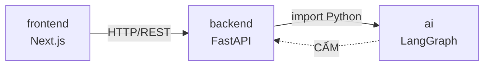
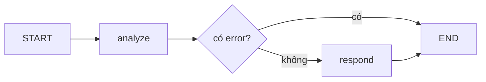
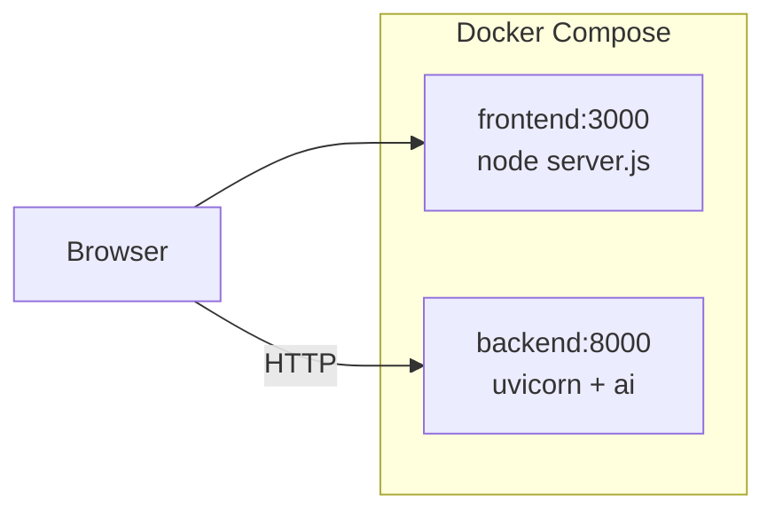

# Architecture Document

## System Overview

Monorepo gồm 3 module độc lập: `frontend/` (Next.js), `backend/` (FastAPI, bố cục MVC),
và `ai/` (LangGraph agent). Backend import `ai` như một thư viện Python trong cùng
process; frontend nói chuyện với backend qua HTTP.

## Module Boundaries

Đây là phần quan trọng nhất của tài liệu này. Ranh giới được kiểm tra tự động bằng
`scripts/check_boundaries.sh` (chạy trong CI, hoặc `make boundaries`).

| Quy tắc | Vì sao | Kiểm tra bởi |
|---|---|---|
| `ai` không import `backend` | AI phải dùng được ngoài HTTP: trong notebook, CLI, batch job | `check_boundaries.sh` |
| Chỉ `backend/services/` import `ai` | Controller đổi agent mà không phải sửa HTTP layer, và ngược lại | `check_boundaries.sh` |
| FE chỉ gọi HTTP qua `lib/api/` | Đổi base URL / auth header / xử lý lỗi chỉ sửa một chỗ | `check_boundaries.sh` |
| `ai` chỉ được import qua `ai/__init__.py` | `nodes`, `tools`, `state` là nội bộ, đổi tự do | quy ước |

Config cũng tách theo ranh giới này: `ai/config.py` giữ LLM + vector store,
`backend/config.py` giữ app + CORS + database. Cả hai cùng đọc `.env` ở gốc repo.

## Components

### 1. `ai/` — LangGraph Agent

Không biết gì về HTTP. Nhận input Python, trả `AgentResult` (dataclass).

- **Interface công khai:** `ai/src/ai/__init__.py` → `run_agent(query) -> AgentResult`
- **State:** `AgentState` (TypedDict) — query, context, analysis, response, error, metadata
- **Nodes:** `analyze` → `respond`
- **Tools:** `search_knowledge`, `calculate`
- **Flow:**

### 2. `backend/` — FastAPI theo MVC

REST API không có "View" kiểu template HTML — ở đây **response body chính là view**.

| Tầng | Thư mục | Trách nhiệm |
|---|---|---|
| **C**ontroller | `controllers/` | Nhận HTTP, gọi service, trả view. Không chứa nghiệp vụ. |
| **M**odel | `models/` | Domain model + request schema |
| **V**iew | `views/` | Response schema (dùng trong `response_model`) |
| Service | `services/` | Nghiệp vụ. Tầng duy nhất import `ai`. |

Luồng: `controller → service → ai`, rồi `domain model → view → JSON`.

Lỗi agent được `ChatService` bọc thành `AgentError`, controller đổi thành HTTP 502.

### 3. `frontend/` — Next.js 14 App Router

Chia theo **feature**, không theo loại file. Thêm chức năng = thêm một thư mục trong
`features/`, không đụng phần còn lại.

| Thư mục | Trách nhiệm |
|---|---|
| `app/` | Routes — chỉ lắp ráp, không chứa logic |
| `features/<name>/` | Trọn vẹn một chức năng: components, hooks, api, types |
| `components/ui/` | Design system dùng chung |
| `lib/api/` | HTTP client — chỗ duy nhất gọi `fetch()` |
| `hooks/`, `types/` | Dùng chung nhiều feature |

Mỗi feature có `index.ts` làm interface công khai; bên ngoài không import sâu vào trong.

## Data Flow

1. User gõ tin nhắn → `MessageInput` → `useChat` hook
2. `useChat` → `chatApi.sendChatMessage` → `apiClient.post` → HTTP POST `/api/v1/chat`
3. `chat_controller` validate `ChatRequest` → gọi `ChatService.send_message`
4. `ChatService` → `ai.run_agent` → LangGraph pipeline → `AgentResult`
5. `ChatService` trả `ChatMessage` (domain) → `ChatResponse.from_domain` → JSON
6. `useChat` cập nhật state → `MessageList` render

## Deployment Architecture

`ai` không có container riêng — nó nằm trong image của backend vì là thư viện.
`backend/Dockerfile` build từ gốc repo (cần copy cả `ai/` lẫn `backend/`).

Lưu ý: `NEXT_PUBLIC_API_URL` được nhúng vào bundle **lúc build**, không phải lúc chạy,
nên nó là build arg trong `frontend/Dockerfile`. Trình duyệt là bên gọi backend, nên
giá trị phải là URL nhìn từ máy user — không phải hostname nội bộ của compose.

## Security

- API keys ở `.env` (không bao giờ commit)
- Input validation qua Pydantic (`ChatRequest`: 1–5000 ký tự)
- `calculate` tool parse AST thay vì `eval()`
- CORS giới hạn theo `CORS_ORIGINS`
- Container chạy bằng non-root user (`appuser` / `nextjs`)

## Design Decisions

| Quyết định | Chọn | Lý do |
|---|---|---|
| Cấu trúc repo | Monorepo 3 module | Tách rõ mà vẫn atomic commit xuyên module |
| BE ↔ AI | Import trong process | Đủ cho quy mô hiện tại; không có độ trễ mạng, dễ debug. Nếu cần scale AI riêng, `run_agent` là chỗ duy nhất phải đổi thành HTTP call. |
| Bố cục BE | MVC + service | Yêu cầu dự án; service tách nghiệp vụ khỏi HTTP |
| Bố cục FE | Feature-based | Mở rộng theo chức năng, không theo loại file |
| Framework BE | FastAPI | Async, auto-docs, type-safe |
| Agent | LangGraph | Quản lý state linh hoạt |
| Frontend | Next.js 14 App Router | Chuẩn dự án lớn, SSR sẵn |
