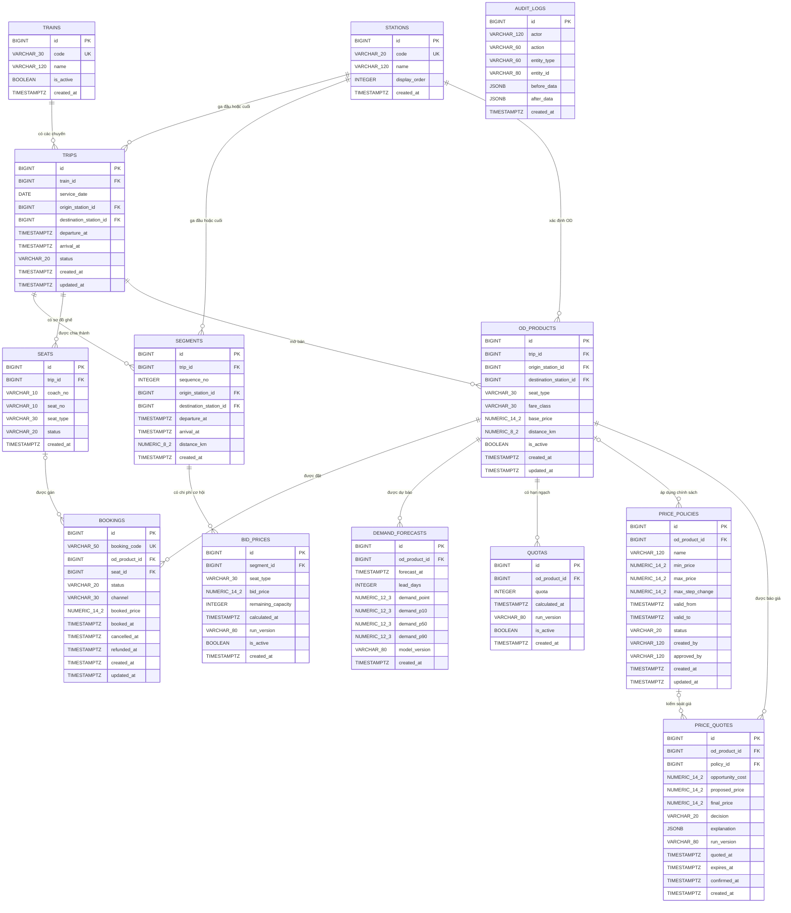

# Database Schema — SRRM MVP

Tài liệu này mô tả schema PostgreSQL trong `schema.sql` của hệ thống **Smart Rail Revenue Management (SRRM)**. Schema gồm 13 bảng, tập trung vào dữ liệu tối thiểu để demo dự báo nhu cầu, tối ưu chỗ, bid price, hạn ngạch và định giá động.

## 1. Tổng quan quan hệ

### Ký hiệu

- `PK`: khóa chính.
- `FK`: khóa ngoại.
- `UK`: giá trị hoặc tổ hợp giá trị duy nhất.
- `OD` (Origin–Destination): cặp ga đi và ga đến.
- `segment`: chặng giữa hai ga liên tiếp của một chuyến tàu.
- `bid price`: chi phí cơ hội của một chỗ trên một chặng.

## 2. Nhóm dữ liệu vận hành đường sắt

### 2.1. `stations` — Danh mục ga

Lưu danh sách ga được sử dụng trong MVP. Đây là bảng danh mục gốc để xác định ga đầu, ga cuối của chuyến, chặng và sản phẩm OD.

| Field | Kiểu dữ liệu | Ràng buộc | Ý nghĩa |
|---|---|---|---|
| `id` | `BIGINT` | PK, tự tăng | Định danh nội bộ của ga. |
| `code` | `VARCHAR(20)` | NOT NULL, UNIQUE | Mã ga dùng khi trao đổi dữ liệu và gọi API. |
| `name` | `VARCHAR(120)` | NOT NULL | Tên hiển thị của ga. |
| `display_order` | `INTEGER` | Có thể null, `>= 0` | Thứ tự mặc định của ga trên tuyến để hỗ trợ sắp xếp giao diện. |
| `created_at` | `TIMESTAMPTZ` | NOT NULL, mặc định thời điểm hiện tại | Thời điểm tạo bản ghi. |

**Tác dụng:** tránh lặp lại tên và mã ga ở nhiều bảng, đồng thời bảo đảm chuyến, chặng và OD cùng tham chiếu một danh mục ga thống nhất.

### 2.2. `trains` — Danh mục tàu

Lưu mã tàu hoặc dịch vụ tàu, ví dụ SE1, SE2. Một tàu có thể phát sinh nhiều chuyến chạy ở các ngày khác nhau.

| Field | Kiểu dữ liệu | Ràng buộc | Ý nghĩa |
|---|---|---|---|
| `id` | `BIGINT` | PK, tự tăng | Định danh nội bộ của tàu. |
| `code` | `VARCHAR(30)` | NOT NULL, UNIQUE | Mã tàu duy nhất. |
| `name` | `VARCHAR(120)` | Có thể null | Tên mô tả của tàu. |
| `is_active` | `BOOLEAN` | NOT NULL, mặc định `TRUE` | Cho biết tàu còn được sử dụng trong phạm vi hệ thống hay không. |
| `created_at` | `TIMESTAMPTZ` | NOT NULL, mặc định thời điểm hiện tại | Thời điểm tạo bản ghi. |

**Tác dụng:** tách định danh tàu khỏi từng ngày chạy, giúp cùng một mã tàu được tái sử dụng cho nhiều `trips`.

### 2.3. `trips` — Chuyến tàu theo ngày

Đại diện cho một lần chạy cụ thể của một tàu vào một ngày. Đây là thực thể trung tâm kết nối hành trình, ghế và các sản phẩm vé.

| Field | Kiểu dữ liệu | Ràng buộc | Ý nghĩa |
|---|---|---|---|
| `id` | `BIGINT` | PK, tự tăng | Định danh chuyến. |
| `train_id` | `BIGINT` | FK → `trains.id`, NOT NULL | Tàu thực hiện chuyến. |
| `service_date` | `DATE` | NOT NULL | Ngày chạy của chuyến. |
| `origin_station_id` | `BIGINT` | FK → `stations.id`, NOT NULL | Ga đầu toàn hành trình. |
| `destination_station_id` | `BIGINT` | FK → `stations.id`, NOT NULL | Ga cuối toàn hành trình. |
| `departure_at` | `TIMESTAMPTZ` | NOT NULL | Thời điểm khởi hành. |
| `arrival_at` | `TIMESTAMPTZ` | NOT NULL, sau `departure_at` | Thời điểm kết thúc hành trình. |
| `status` | `VARCHAR(20)` | NOT NULL | Trạng thái: `scheduled`, `boarding`, `departed`, `completed`, `cancelled`. |
| `created_at` | `TIMESTAMPTZ` | NOT NULL | Thời điểm tạo bản ghi. |
| `updated_at` | `TIMESTAMPTZ` | NOT NULL | Thời điểm cập nhật gần nhất, do ứng dụng quản lý. |

Tổ hợp `(train_id, service_date)` là duy nhất.

**Tác dụng:** gom mọi dữ liệu của một lần chạy vào cùng một phạm vi để dashboard có thể lọc theo tàu và ngày.

### 2.4. `segments` — Các chặng liên tiếp

Chia một `trip` thành các chặng giữa hai ga liên tiếp. Bid price và tải chặng được tính ở cấp này.

| Field | Kiểu dữ liệu | Ràng buộc | Ý nghĩa |
|---|---|---|---|
| `id` | `BIGINT` | PK, tự tăng | Định danh chặng. |
| `trip_id` | `BIGINT` | FK → `trips.id`, NOT NULL, CASCADE DELETE | Chuyến chứa chặng. |
| `sequence_no` | `INTEGER` | NOT NULL, `> 0` | Thứ tự chặng trong hành trình. |
| `origin_station_id` | `BIGINT` | FK → `stations.id`, NOT NULL | Ga đầu chặng. |
| `destination_station_id` | `BIGINT` | FK → `stations.id`, NOT NULL | Ga cuối chặng. |
| `departure_at` | `TIMESTAMPTZ` | NOT NULL | Giờ rời ga đầu chặng. |
| `arrival_at` | `TIMESTAMPTZ` | NOT NULL, sau `departure_at` | Giờ đến ga cuối chặng. |
| `distance_km` | `NUMERIC(8,2)` | NOT NULL, `> 0` | Chiều dài chặng tính theo kilomet. |
| `created_at` | `TIMESTAMPTZ` | NOT NULL | Thời điểm tạo bản ghi. |

Mỗi chuyến không được có hai chặng cùng `sequence_no` hoặc cùng cặp ga đầu–ga cuối.

**Tác dụng:** cung cấp đơn vị nhỏ nhất để tính tải, sức chứa còn lại, nút cổ chai và chi phí cơ hội. Một OD dài có thể đi qua nhiều chặng.

### 2.5. `seats` — Ghế hoặc giường của chuyến

Lưu sơ đồ chỗ vật lý cho từng chuyến, bao gồm toa, số chỗ, loại chỗ và trạng thái vận hành.

| Field | Kiểu dữ liệu | Ràng buộc | Ý nghĩa |
|---|---|---|---|
| `id` | `BIGINT` | PK, tự tăng | Định danh chỗ vật lý. |
| `trip_id` | `BIGINT` | FK → `trips.id`, NOT NULL, CASCADE DELETE | Chuyến sở hữu chỗ. |
| `coach_no` | `VARCHAR(10)` | NOT NULL | Số hoặc mã toa. |
| `seat_no` | `VARCHAR(10)` | NOT NULL | Số hoặc mã ghế/giường trong toa. |
| `seat_type` | `VARCHAR(30)` | NOT NULL | Loại chỗ, ví dụ ngồi mềm hoặc giường nằm khoang 6. |
| `status` | `VARCHAR(20)` | NOT NULL | Trạng thái: `available`, `locked`, `maintenance`. |
| `created_at` | `TIMESTAMPTZ` | NOT NULL | Thời điểm tạo bản ghi. |

Tổ hợp `(trip_id, coach_no, seat_no)` là duy nhất.

**Tác dụng:** phục vụ gán ghế vật lý, kiểm tra ghế khóa và phát hiện các khoảng ghế còn trống giữa những OD đã bán.

## 3. Nhóm sản phẩm vé và giao dịch

### 3.1. `od_products` — Sản phẩm vé OD

Mỗi bản ghi là một sản phẩm có thể bán trên một chuyến: đi từ ga A đến ga B, theo loại chỗ và hạng vé cụ thể.

| Field | Kiểu dữ liệu | Ràng buộc | Ý nghĩa |
|---|---|---|---|
| `id` | `BIGINT` | PK, tự tăng | Định danh sản phẩm OD. |
| `trip_id` | `BIGINT` | FK → `trips.id`, NOT NULL, CASCADE DELETE | Chuyến áp dụng. |
| `origin_station_id` | `BIGINT` | FK → `stations.id`, NOT NULL | Ga hành khách lên tàu. |
| `destination_station_id` | `BIGINT` | FK → `stations.id`, NOT NULL | Ga hành khách xuống tàu. |
| `seat_type` | `VARCHAR(30)` | NOT NULL | Loại chỗ của sản phẩm. |
| `fare_class` | `VARCHAR(30)` | NOT NULL, mặc định `standard` | Hạng giá như tiết kiệm, tiêu chuẩn hoặc linh hoạt. |
| `base_price` | `NUMERIC(14,2)` | NOT NULL, `>= 0` | Giá cơ sở trước tối ưu và ràng buộc giá. |
| `distance_km` | `NUMERIC(8,2)` | NOT NULL, `> 0` | Tổng cự ly của OD. |
| `is_active` | `BOOLEAN` | NOT NULL | Cho biết sản phẩm đang được phép bán. |
| `created_at` | `TIMESTAMPTZ` | NOT NULL | Thời điểm tạo bản ghi. |
| `updated_at` | `TIMESTAMPTZ` | NOT NULL | Thời điểm cập nhật gần nhất. |

Tổ hợp `(trip_id, origin_station_id, destination_station_id, seat_type, fare_class)` là duy nhất.

**Tác dụng:** là điểm nối chung cho dự báo, quota, báo giá và booking. Nhờ đó các kết quả AI đều tham chiếu đúng một sản phẩm bán cụ thể.

### 3.2. `bookings` — Đặt vé

Lưu giao dịch giữ chỗ, xác nhận mua, hủy hoặc hoàn vé. Dữ liệu này là đầu vào để tính tải chặng, doanh thu và cập nhật dự báo.

| Field | Kiểu dữ liệu | Ràng buộc | Ý nghĩa |
|---|---|---|---|
| `id` | `BIGINT` | PK, tự tăng | Định danh giao dịch. |
| `booking_code` | `VARCHAR(50)` | NOT NULL, UNIQUE | Mã đặt vé duy nhất từ hệ thống bán vé. |
| `od_product_id` | `BIGINT` | FK → `od_products.id`, NOT NULL | Sản phẩm OD được mua. |
| `seat_id` | `BIGINT` | FK → `seats.id`, có thể null | Ghế được gán; có thể chưa có khi mới giữ chỗ. |
| `status` | `VARCHAR(20)` | NOT NULL | Trạng thái: `held`, `confirmed`, `cancelled`, `refunded`. |
| `channel` | `VARCHAR(30)` | Có thể null | Kênh bán như web, ứng dụng, quầy hoặc đại lý. |
| `booked_price` | `NUMERIC(14,2)` | NOT NULL, `>= 0` | Giá đã được chốt cho booking. |
| `booked_at` | `TIMESTAMPTZ` | NOT NULL | Thời điểm đặt vé. |
| `cancelled_at` | `TIMESTAMPTZ` | Có thể null | Thời điểm hủy vé. |
| `refunded_at` | `TIMESTAMPTZ` | Có thể null | Thời điểm hoàn tiền. |
| `created_at` | `TIMESTAMPTZ` | NOT NULL | Thời điểm tạo bản ghi. |
| `updated_at` | `TIMESTAMPTZ` | NOT NULL | Thời điểm cập nhật gần nhất. |

**Tác dụng:** phản ánh nhu cầu thực tế và tình trạng sử dụng ghế. Khi có mua hoặc hủy vé, hệ thống có thể tính lại dự báo, quota, bid price và giá.

## 4. Nhóm kết quả dự báo và tối ưu

### 4.1. `demand_forecasts` — Kết quả dự báo nhu cầu

Lưu dự báo theo từng sản phẩm OD tại từng thời điểm và số ngày còn lại trước ngày chạy.

| Field | Kiểu dữ liệu | Ràng buộc | Ý nghĩa |
|---|---|---|---|
| `id` | `BIGINT` | PK, tự tăng | Định danh kết quả dự báo. |
| `od_product_id` | `BIGINT` | FK → `od_products.id`, NOT NULL, CASCADE DELETE | Sản phẩm được dự báo. |
| `forecast_at` | `TIMESTAMPTZ` | NOT NULL | Thời điểm mô hình chạy dự báo. |
| `lead_days` | `INTEGER` | NOT NULL, `>= 0` | Số ngày từ thời điểm dự báo đến ngày tàu chạy. |
| `demand_point` | `NUMERIC(12,3)` | NOT NULL, `>= 0` | Giá trị dự báo điểm. |
| `demand_p10` | `NUMERIC(12,3)` | Có thể null, `>= 0` | Phân vị 10%, đại diện kịch bản nhu cầu thấp. |
| `demand_p50` | `NUMERIC(12,3)` | Có thể null, `>= 0` | Phân vị 50%, trung vị dự báo. |
| `demand_p90` | `NUMERIC(12,3)` | Có thể null, `>= 0` | Phân vị 90%, đại diện kịch bản nhu cầu cao. |
| `model_version` | `VARCHAR(80)` | Có thể null | Phiên bản mô hình tạo ra kết quả. |
| `created_at` | `TIMESTAMPTZ` | NOT NULL | Thời điểm lưu kết quả. |

Các phân vị phải thỏa `p10 <= p50 <= p90` khi cùng có dữ liệu. Tổ hợp `(od_product_id, forecast_at, lead_days)` là duy nhất.

**Tác dụng:** cấp dữ liệu cho dashboard nhu cầu, bài toán tối ưu hạn ngạch và so sánh nhu cầu dự kiến giữa các OD.

### 4.2. `bid_prices` — Chi phí cơ hội theo chặng

Lưu bid price của từng loại chỗ trên từng chặng tại mỗi lần chạy tối ưu.

| Field | Kiểu dữ liệu | Ràng buộc | Ý nghĩa |
|---|---|---|---|
| `id` | `BIGINT` | PK, tự tăng | Định danh kết quả bid price. |
| `segment_id` | `BIGINT` | FK → `segments.id`, NOT NULL, CASCADE DELETE | Chặng được định giá cơ hội. |
| `seat_type` | `VARCHAR(30)` | NOT NULL | Loại chỗ áp dụng. |
| `bid_price` | `NUMERIC(14,2)` | NOT NULL, `>= 0` | Chi phí cơ hội của một chỗ trên chặng. |
| `remaining_capacity` | `INTEGER` | NOT NULL, `>= 0` | Sức chứa còn lại khi thuật toán chạy. |
| `calculated_at` | `TIMESTAMPTZ` | NOT NULL | Thời điểm tính toán. |
| `run_version` | `VARCHAR(80)` | NOT NULL | Mã phiên chạy để nhóm và phục hồi kết quả. |
| `is_active` | `BOOLEAN` | NOT NULL | Đánh dấu phiên kết quả đang được sử dụng. |
| `created_at` | `TIMESTAMPTZ` | NOT NULL | Thời điểm lưu bản ghi. |

Tổ hợp `(segment_id, seat_type, run_version)` là duy nhất.

**Tác dụng:** giúp hệ thống không bán rẻ một OD đi qua chặng khan hiếm. Tổng bid price của các chặng mà OD đi qua tạo thành `opportunity_cost` cho báo giá.

### 4.3. `quotas` — Hạn ngạch bán

Lưu số lượng chỗ đề xuất được phép bán cho từng sản phẩm OD theo mỗi phiên tối ưu.

| Field | Kiểu dữ liệu | Ràng buộc | Ý nghĩa |
|---|---|---|---|
| `id` | `BIGINT` | PK, tự tăng | Định danh hạn ngạch. |
| `od_product_id` | `BIGINT` | FK → `od_products.id`, NOT NULL, CASCADE DELETE | Sản phẩm OD nhận hạn ngạch. |
| `quota` | `INTEGER` | NOT NULL, `>= 0` | Số chỗ được phân bổ cho sản phẩm. |
| `calculated_at` | `TIMESTAMPTZ` | NOT NULL | Thời điểm tính hạn ngạch. |
| `run_version` | `VARCHAR(80)` | NOT NULL | Mã phiên chạy tối ưu. |
| `is_active` | `BOOLEAN` | NOT NULL | Đánh dấu phiên hạn ngạch đang áp dụng. |
| `created_at` | `TIMESTAMPTZ` | NOT NULL | Thời điểm lưu bản ghi. |

Tổ hợp `(od_product_id, run_version)` là duy nhất.

**Tác dụng:** cân bằng chỗ giữa khách đi chặng dài, chặng ngắn và ga trung gian; tránh một nhóm OD chiếm toàn bộ sức chứa.

## 5. Nhóm chính sách và định giá động

### 5.1. `price_policies` — Chính sách kiểm soát giá

Lưu trần, sàn và mức biến động giá tối đa đã được cấu hình hoặc phê duyệt. `od_product_id` có thể null để biểu diễn chính sách chung; khi có giá trị, chính sách áp dụng cho sản phẩm cụ thể.

| Field | Kiểu dữ liệu | Ràng buộc | Ý nghĩa |
|---|---|---|---|
| `id` | `BIGINT` | PK, tự tăng | Định danh chính sách. |
| `od_product_id` | `BIGINT` | FK → `od_products.id`, có thể null, CASCADE DELETE | Sản phẩm áp dụng chính sách; null nếu là chính sách chung. |
| `name` | `VARCHAR(120)` | NOT NULL | Tên chính sách. |
| `min_price` | `NUMERIC(14,2)` | NOT NULL, `>= 0` | Giá sàn được phép. |
| `max_price` | `NUMERIC(14,2)` | NOT NULL, `>= min_price` | Giá trần được phép. |
| `max_step_change` | `NUMERIC(14,2)` | NOT NULL, `>= 0` | Mức thay đổi giá tối đa giữa hai lần tính liên tiếp. |
| `valid_from` | `TIMESTAMPTZ` | NOT NULL | Thời điểm chính sách bắt đầu hiệu lực. |
| `valid_to` | `TIMESTAMPTZ` | Có thể null, sau `valid_from` | Thời điểm hết hiệu lực; null nếu chưa xác định. |
| `status` | `VARCHAR(20)` | NOT NULL | Trạng thái: `draft`, `active`, `inactive`. |
| `created_by` | `VARCHAR(120)` | Có thể null | Người tạo chính sách. |
| `approved_by` | `VARCHAR(120)` | Có thể null | Người phê duyệt chính sách. |
| `created_at` | `TIMESTAMPTZ` | NOT NULL | Thời điểm tạo bản ghi. |
| `updated_at` | `TIMESTAMPTZ` | NOT NULL | Thời điểm cập nhật gần nhất. |

**Tác dụng:** là lớp Policy Guard ngăn AI đề xuất giá ngoài giới hạn và hỗ trợ quản lý can thiệp thủ công.

### 5.2. `price_quotes` — Kết quả báo giá động

Lưu kết quả tính giá cho một sản phẩm OD, gồm chi phí cơ hội, giá AI đề xuất, giá cuối sau Policy Guard và phần giải thích.

| Field | Kiểu dữ liệu | Ràng buộc | Ý nghĩa |
|---|---|---|---|
| `id` | `BIGINT` | PK, tự tăng | Định danh lần báo giá. |
| `od_product_id` | `BIGINT` | FK → `od_products.id`, NOT NULL | Sản phẩm được báo giá. |
| `policy_id` | `BIGINT` | FK → `price_policies.id`, có thể null | Chính sách dùng để kiểm soát giá. |
| `opportunity_cost` | `NUMERIC(14,2)` | NOT NULL, `>= 0` | Tổng bid price của các chặng OD đi qua. |
| `proposed_price` | `NUMERIC(14,2)` | NOT NULL, `>= 0` | Giá do thuật toán đề xuất trước khi áp chính sách. |
| `final_price` | `NUMERIC(14,2)` | NOT NULL, `>= 0` | Giá cuối sau khi ép trần, sàn và mức biến động. |
| `decision` | `VARCHAR(20)` | NOT NULL | Kết quả: `accepted`, `rejected`, `blocked`. |
| `explanation` | `JSONB` | NOT NULL, mặc định `{}` | Dữ liệu giải thích như tải chặng, bid price và quy tắc đã áp dụng. |
| `run_version` | `VARCHAR(80)` | Có thể null | Phiên thuật toán tạo báo giá. |
| `quoted_at` | `TIMESTAMPTZ` | NOT NULL | Thời điểm tạo báo giá. |
| `expires_at` | `TIMESTAMPTZ` | Có thể null, sau `quoted_at` | Thời điểm báo giá hết hiệu lực. |
| `confirmed_at` | `TIMESTAMPTZ` | Có thể null, không trước `quoted_at` | Thời điểm khách xác nhận giá. |
| `created_at` | `TIMESTAMPTZ` | NOT NULL | Thời điểm lưu bản ghi. |

**Tác dụng:** cung cấp dữ liệu cho API `/v1/quote`, giải thích được quyết định định giá và giữ lại lịch sử các phiên giá để so sánh hoặc rollback ở mức ứng dụng.

## 6. Nhóm kiểm toán

### 6.1. `audit_logs` — Nhật ký thay đổi

Lưu ai đã thay đổi đối tượng nào và trạng thái trước/sau của thay đổi. Bảng dùng cấu trúc tổng quát để không phải tạo log riêng cho từng bảng nghiệp vụ.

| Field | Kiểu dữ liệu | Ràng buộc | Ý nghĩa |
|---|---|---|---|
| `id` | `BIGINT` | PK, tự tăng | Định danh log. |
| `actor` | `VARCHAR(120)` | NOT NULL | Người dùng hoặc dịch vụ thực hiện hành động. |
| `action` | `VARCHAR(60)` | NOT NULL | Loại hành động, ví dụ tạo, cập nhật, phê duyệt hoặc rollback. |
| `entity_type` | `VARCHAR(60)` | NOT NULL | Loại đối tượng bị tác động, ví dụ `price_policy`. |
| `entity_id` | `VARCHAR(80)` | Có thể null | ID của đối tượng dưới dạng chuỗi. |
| `before_data` | `JSONB` | Có thể null | Trạng thái dữ liệu trước thay đổi. |
| `after_data` | `JSONB` | Có thể null | Trạng thái dữ liệu sau thay đổi. |
| `created_at` | `TIMESTAMPTZ` | NOT NULL | Thời điểm hành động xảy ra. |

**Tác dụng:** hỗ trợ truy vết thay đổi chính sách, giải trình quyết định và phục hồi trạng thái trước đó.

## 7. Luồng dữ liệu chính của MVP

1. `stations`, `trains`, `trips`, `segments` và `seats` mô tả chuyến tàu cùng sức chứa vật lý.
2. `od_products` định nghĩa các vé có thể bán theo cặp ga, loại chỗ và hạng giá.
3. `bookings` ghi nhận giao dịch thực tế; dữ liệu này được dùng để tính tải chặng và nhu cầu đã phát sinh.
4. Mô hình AI ghi kết quả nhu cầu vào `demand_forecasts`.
5. Bộ tối ưu sử dụng sức chứa, booking và dự báo để tạo `bid_prices` cùng `quotas`.
6. Bộ định giá cộng chi phí cơ hội vào logic giá, sau đó áp giới hạn trong `price_policies` và lưu kết quả vào `price_quotes`.
7. Các thay đổi quan trọng do quản lý hoặc hệ thống thực hiện được ghi vào `audit_logs`.

Các dữ liệu như heatmap tải chặng, cảnh báo chặng gần đầy, seat plan, khoảng ghế trống và kết quả mô phỏng có thể tính từ các bảng trên khi cần. MVP không tạo bảng riêng cho các dữ liệu dẫn xuất này để tránh lưu trùng và giảm thời gian triển khai.
