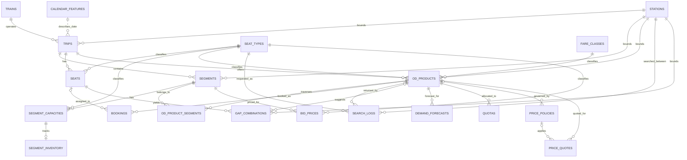

# Database Schema — SRRM MVP

Tài liệu này mô tả schema PostgreSQL trong [`schema.sql`](schema.sql) của hệ thống **Smart Rail Revenue Management (SRRM)**. Schema gồm **21 bảng**, **5 index tường minh**, **1 trigger function** và **7 trigger**, phục vụ dữ liệu vận hành, tồn kho theo chặng, sản phẩm vé OD, giao dịch, dự báo nhu cầu, tối ưu doanh thu, định giá động và kiểm toán.

> Phạm vi hiện tại gồm bảng, ràng buộc, index và trigger tự động cập nhật `updated_at`; không có seed data hoặc view.

## 1. Tổng quan quan hệ

`calendar_features.service_date` có cùng miền dữ liệu với `trips.service_date` nhưng schema **không khai báo khóa ngoại** giữa hai trường; đường nét đứt trong sơ đồ chỉ biểu diễn quan hệ nghiệp vụ.

### Ký hiệu

- `PK`: khóa chính.
- `FK`: khóa ngoại.
- `UK`: giá trị hoặc tổ hợp giá trị duy nhất.
- `OD` (Origin–Destination): cặp ga đi và ga đến.
- `segment`: chặng giữa hai ga liên tiếp của một chuyến tàu.
- `bid price`: chi phí cơ hội của một chỗ trên một chặng.

## 2. Danh mục và lịch

### 2.1. `stations` — Danh mục ga

| Trường | Kiểu | Ràng buộc / mặc định | Ý nghĩa |
|---|---|---|---|
| `id` | `BIGINT` | PK, identity | Định danh ga. |
| `code` | `VARCHAR(20)` | NOT NULL, UNIQUE | Mã ga duy nhất. |
| `name` | `VARCHAR(120)` | NOT NULL | Tên ga. |
| `display_order` | `INTEGER` | NULL, `>= 0` | Thứ tự hiển thị. |
| `created_at` | `TIMESTAMPTZ` | NOT NULL, `CURRENT_TIMESTAMP` | Thời điểm tạo. |

### 2.2. `trains` — Danh mục tàu

| Trường | Kiểu | Ràng buộc / mặc định | Ý nghĩa |
|---|---|---|---|
| `id` | `BIGINT` | PK, identity | Định danh tàu. |
| `code` | `VARCHAR(30)` | NOT NULL, UNIQUE | Mã tàu duy nhất. |
| `name` | `VARCHAR(120)` | NULL | Tên tàu. |
| `is_active` | `BOOLEAN` | NOT NULL, `TRUE` | Tàu còn hoạt động hay không. |
| `created_at` | `TIMESTAMPTZ` | NOT NULL, `CURRENT_TIMESTAMP` | Thời điểm tạo. |

### 2.3. `seat_types` — Danh mục loại chỗ

| Trường | Kiểu | Ràng buộc / mặc định | Ý nghĩa |
|---|---|---|---|
| `code` | `VARCHAR(30)` | PK | Mã loại ghế/giường. |
| `name` | `VARCHAR(120)` | NOT NULL | Tên loại chỗ. |
| `is_active` | `BOOLEAN` | NOT NULL, `TRUE` | Loại chỗ còn được sử dụng. |
| `created_at` | `TIMESTAMPTZ` | NOT NULL, `CURRENT_TIMESTAMP` | Thời điểm tạo. |

Được tham chiếu bởi `seats`, `segment_capacities`, `od_products`, `search_logs` và `bid_prices`.

### 2.4. `fare_classes` — Danh mục hạng giá

| Trường | Kiểu | Ràng buộc / mặc định | Ý nghĩa |
|---|---|---|---|
| `code` | `VARCHAR(30)` | PK | Mã hạng giá. |
| `name` | `VARCHAR(120)` | NOT NULL | Tên hạng giá. |
| `is_active` | `BOOLEAN` | NOT NULL, `TRUE` | Hạng giá còn được sử dụng. |
| `created_at` | `TIMESTAMPTZ` | NOT NULL, `CURRENT_TIMESTAMP` | Thời điểm tạo. |

`od_products.fare_class` mặc định là `standard`, vì vậy bản ghi mã `standard` phải tồn tại trước khi dùng giá trị mặc định này.

### 2.5. `calendar_features` — Đặc trưng lịch

| Trường | Kiểu | Ràng buộc / mặc định | Ý nghĩa |
|---|---|---|---|
| `service_date` | `DATE` | PK | Ngày vận hành. |
| `is_holiday` | `BOOLEAN` | NOT NULL, `FALSE` | Có phải ngày lễ. |
| `is_tet` | `BOOLEAN` | NOT NULL, `FALSE` | Có thuộc dịp Tết. |
| `season` | `VARCHAR(20)` | NULL | Mùa hoặc giai đoạn trong năm. |
| `weather` | `VARCHAR(30)` | NULL | Nhóm thời tiết. |
| `local_event` | `VARCHAR(120)` | NULL | Sự kiện địa phương. |
| `created_at` | `TIMESTAMPTZ` | NOT NULL, `CURRENT_TIMESTAMP` | Thời điểm tạo. |
| `updated_at` | `TIMESTAMPTZ` | NOT NULL, `CURRENT_TIMESTAMP` | Thời điểm cập nhật. |

Đây là nguồn feature theo ngày cho dự báo; schema chưa ép quan hệ FK với `trips`.

## 3. Vận hành chuyến tàu và tồn kho

### 3.1. `trips` — Chuyến tàu theo ngày

| Trường | Kiểu | Ràng buộc / mặc định | Ý nghĩa |
|---|---|---|---|
| `id` | `BIGINT` | PK, identity | Định danh chuyến. |
| `train_id` | `BIGINT` | FK → `trains.id`, NOT NULL | Tàu vận hành. |
| `service_date` | `DATE` | NOT NULL | Ngày chạy. |
| `origin_station_id` | `BIGINT` | FK → `stations.id`, NOT NULL | Ga đầu chuyến. |
| `destination_station_id` | `BIGINT` | FK → `stations.id`, NOT NULL | Ga cuối chuyến. |
| `departure_at` | `TIMESTAMPTZ` | NOT NULL | Thời gian khởi hành. |
| `arrival_at` | `TIMESTAMPTZ` | NOT NULL, `> departure_at` | Thời gian đến. |
| `status` | `VARCHAR(20)` | NOT NULL, `scheduled` | `scheduled`, `boarding`, `departed`, `completed`, `cancelled`. |
| `created_at` | `TIMESTAMPTZ` | NOT NULL, `CURRENT_TIMESTAMP` | Thời điểm tạo. |
| `updated_at` | `TIMESTAMPTZ` | NOT NULL, `CURRENT_TIMESTAMP` | Thời điểm cập nhật. |

Ràng buộc thêm: `(train_id, service_date)` là duy nhất và ga đầu phải khác ga cuối.

### 3.2. `segments` — Chặng liên tiếp

| Trường | Kiểu | Ràng buộc / mặc định | Ý nghĩa |
|---|---|---|---|
| `id` | `BIGINT` | PK, identity | Định danh chặng. |
| `trip_id` | `BIGINT` | FK → `trips.id`, NOT NULL, ON DELETE CASCADE | Chuyến chứa chặng. |
| `sequence_no` | `INTEGER` | NOT NULL, `> 0` | Thứ tự chặng. |
| `origin_station_id` | `BIGINT` | FK → `stations.id`, NOT NULL | Ga đầu chặng. |
| `destination_station_id` | `BIGINT` | FK → `stations.id`, NOT NULL | Ga cuối chặng. |
| `departure_at` | `TIMESTAMPTZ` | NOT NULL | Giờ rời ga. |
| `arrival_at` | `TIMESTAMPTZ` | NOT NULL, `> departure_at` | Giờ đến ga. |
| `distance_km` | `NUMERIC(8,2)` | NOT NULL, `> 0` | Cự ly chặng. |
| `created_at` | `TIMESTAMPTZ` | NOT NULL, `CURRENT_TIMESTAMP` | Thời điểm tạo. |

Mỗi chuyến có duy nhất một `sequence_no` và một cặp `(origin_station_id, destination_station_id)`; ga đầu phải khác ga cuối.

### 3.3. `seats` — Chỗ vật lý của chuyến

| Trường | Kiểu | Ràng buộc / mặc định | Ý nghĩa |
|---|---|---|---|
| `id` | `BIGINT` | PK, identity | Định danh chỗ. |
| `trip_id` | `BIGINT` | FK → `trips.id`, NOT NULL, ON DELETE CASCADE | Chuyến sở hữu chỗ. |
| `coach_no` | `VARCHAR(10)` | NOT NULL | Mã toa. |
| `seat_no` | `VARCHAR(10)` | NOT NULL | Mã ghế/giường trong toa. |
| `seat_type` | `VARCHAR(30)` | FK → `seat_types.code`, NOT NULL | Loại chỗ. |
| `status` | `VARCHAR(20)` | NOT NULL, `available` | `available`, `locked`, `maintenance`. |
| `created_at` | `TIMESTAMPTZ` | NOT NULL, `CURRENT_TIMESTAMP` | Thời điểm tạo. |

Tổ hợp `(trip_id, coach_no, seat_no)` là duy nhất.

### 3.4. `segment_capacities` — Sức chứa theo chặng

| Trường | Kiểu | Ràng buộc / mặc định | Ý nghĩa |
|---|---|---|---|
| `segment_id` | `BIGINT` | PK, FK → `segments.id`, ON DELETE CASCADE | Chặng được cấu hình. |
| `seat_type` | `VARCHAR(30)` | PK, FK → `seat_types.code` | Loại chỗ. |
| `capacity` | `INTEGER` | NOT NULL, `>= 0` | Tổng sức chứa của loại chỗ trên chặng. |
| `created_at` | `TIMESTAMPTZ` | NOT NULL, `CURRENT_TIMESTAMP` | Thời điểm tạo. |
| `updated_at` | `TIMESTAMPTZ` | NOT NULL, `CURRENT_TIMESTAMP` | Thời điểm cập nhật. |

Khóa chính ghép là `(segment_id, seat_type)`.

### 3.5. `segment_inventory` — Tồn kho còn lại theo chặng

| Trường | Kiểu | Ràng buộc / mặc định | Ý nghĩa |
|---|---|---|---|
| `segment_id` | `BIGINT` | PK ghép | Chặng được theo dõi. |
| `seat_type` | `VARCHAR(30)` | PK ghép | Loại chỗ. |
| `remaining` | `INTEGER` | NOT NULL, `>= 0` | Số chỗ còn lại. |
| `updated_at` | `TIMESTAMPTZ` | NOT NULL, `CURRENT_TIMESTAMP` | Thời điểm cập nhật tồn kho. |

Khóa ngoại ghép `(segment_id, seat_type)` tham chiếu `segment_capacities(segment_id, seat_type)` với `ON DELETE CASCADE`. Nhờ đó chỉ có thể tạo tồn kho cho một cấu hình sức chứa đã tồn tại. Schema chưa có CHECK `remaining <= capacity`; ứng dụng phải bảo đảm quy tắc này.

## 4. Sản phẩm vé và giao dịch

### 4.1. `od_products` — Sản phẩm vé OD

| Trường | Kiểu | Ràng buộc / mặc định | Ý nghĩa |
|---|---|---|---|
| `id` | `BIGINT` | PK, identity | Định danh sản phẩm. |
| `trip_id` | `BIGINT` | FK → `trips.id`, NOT NULL, ON DELETE CASCADE | Chuyến áp dụng. |
| `origin_station_id` | `BIGINT` | FK → `stations.id`, NOT NULL | Ga lên tàu. |
| `destination_station_id` | `BIGINT` | FK → `stations.id`, NOT NULL | Ga xuống tàu. |
| `seat_type` | `VARCHAR(30)` | FK → `seat_types.code`, NOT NULL | Loại chỗ. |
| `fare_class` | `VARCHAR(30)` | FK → `fare_classes.code`, NOT NULL, `standard` | Hạng giá. |
| `base_price` | `NUMERIC(14,2)` | NOT NULL, `>= 0` | Giá cơ sở. |
| `distance_km` | `NUMERIC(8,2)` | NOT NULL, `> 0` | Tổng cự ly OD. |
| `is_active` | `BOOLEAN` | NOT NULL, `TRUE` | Sản phẩm đang được bán. |
| `created_at` | `TIMESTAMPTZ` | NOT NULL, `CURRENT_TIMESTAMP` | Thời điểm tạo. |
| `updated_at` | `TIMESTAMPTZ` | NOT NULL, `CURRENT_TIMESTAMP` | Thời điểm cập nhật. |

Ga đầu phải khác ga cuối. Tổ hợp `(trip_id, origin_station_id, destination_station_id, seat_type, fare_class)` là duy nhất.

### 4.2. `od_product_segments` — Ánh xạ sản phẩm OD với chặng

| Trường | Kiểu | Ràng buộc / mặc định | Ý nghĩa |
|---|---|---|---|
| `od_product_id` | `BIGINT` | PK, FK → `od_products.id`, ON DELETE CASCADE | Sản phẩm OD. |
| `segment_id` | `BIGINT` | PK, FK → `segments.id`, ON DELETE CASCADE | Chặng mà sản phẩm đi qua. |

Đây là bảng nối nhiều-nhiều. Khóa chính ghép `(od_product_id, segment_id)` ngăn trùng ánh xạ; index `ix_od_product_segments_segment` hỗ trợ truy vấn ngược từ chặng sang sản phẩm.

### 4.3. `bookings` — Đặt vé

| Trường | Kiểu | Ràng buộc / mặc định | Ý nghĩa |
|---|---|---|---|
| `id` | `BIGINT` | PK, identity | Định danh giao dịch. |
| `booking_code` | `VARCHAR(50)` | NOT NULL, UNIQUE | Mã đặt vé. |
| `od_product_id` | `BIGINT` | FK → `od_products.id`, NOT NULL | Sản phẩm được mua. |
| `seat_id` | `BIGINT` | FK → `seats.id`, NULL | Chỗ được gán. |
| `status` | `VARCHAR(20)` | NOT NULL, `confirmed` | `held`, `confirmed`, `cancelled`, `refunded`. |
| `channel` | `VARCHAR(30)` | NULL | Kênh bán. |
| `booked_price` | `NUMERIC(14,2)` | NOT NULL, `>= 0` | Giá đã chốt. |
| `booked_at` | `TIMESTAMPTZ` | NOT NULL | Thời điểm đặt. |
| `expires_at` | `TIMESTAMPTZ` | NULL, `> booked_at` | Hạn giữ chỗ. |
| `cancelled_at` | `TIMESTAMPTZ` | NULL, `>= booked_at` | Thời điểm hủy. |
| `refunded_at` | `TIMESTAMPTZ` | NULL, `>= booked_at` | Thời điểm hoàn tiền. |
| `created_at` | `TIMESTAMPTZ` | NOT NULL, `CURRENT_TIMESTAMP` | Thời điểm tạo. |
| `updated_at` | `TIMESTAMPTZ` | NOT NULL, `CURRENT_TIMESTAMP` | Thời điểm cập nhật. |

### 4.4. `search_logs` — Nhật ký tìm kiếm

| Trường | Kiểu | Ràng buộc / mặc định | Ý nghĩa |
|---|---|---|---|
| `id` | `BIGINT` | PK, identity | Định danh lượt tìm. |
| `searched_at` | `TIMESTAMPTZ` | NOT NULL | Thời điểm tìm kiếm. |
| `origin_station_id` | `BIGINT` | FK → `stations.id`, NOT NULL | Ga đi được tìm. |
| `destination_station_id` | `BIGINT` | FK → `stations.id`, NOT NULL | Ga đến được tìm. |
| `seat_type` | `VARCHAR(30)` | FK → `seat_types.code`, NOT NULL | Loại chỗ được yêu cầu. |
| `service_date` | `DATE` | NOT NULL | Ngày chạy được tìm. |
| `result` | `VARCHAR(20)` | NOT NULL | `found`, `sold_out`, `no_result`. |
| `od_product_id` | `BIGINT` | FK → `od_products.id`, NULL, ON DELETE SET NULL | Sản phẩm được trả về. |
| `channel` | `VARCHAR(30)` | NULL | Kênh tìm kiếm. |
| `created_at` | `TIMESTAMPTZ` | NOT NULL, `CURRENT_TIMESTAMP` | Thời điểm lưu log. |

Ga đi phải khác ga đến. Index `ix_search_logs_demand` hỗ trợ tổng hợp nhu cầu theo ngày, OD, loại chỗ và thời điểm tìm.

### 4.5. `gap_combinations` — Tổ hợp khoảng trống ghế

| Trường | Kiểu | Ràng buộc / mặc định | Ý nghĩa |
|---|---|---|---|
| `id` | `BIGINT` | PK, identity | Định danh gợi ý. |
| `seat_id` | `BIGINT` | FK → `seats.id`, NOT NULL, ON DELETE CASCADE | Chỗ có khoảng trống. |
| `from_station_id` | `BIGINT` | FK → `stations.id`, NOT NULL | Ga đầu khoảng trống. |
| `to_station_id` | `BIGINT` | FK → `stations.id`, NOT NULL | Ga cuối khoảng trống. |
| `suggested_od_product_id` | `BIGINT` | FK → `od_products.id`, NULL, ON DELETE SET NULL | Sản phẩm có thể bán bù. |
| `run_version` | `VARCHAR(80)` | NOT NULL | Phiên tính toán. |
| `is_active` | `BOOLEAN` | NOT NULL, `TRUE` | Gợi ý hiện hành. |
| `created_at` | `TIMESTAMPTZ` | NOT NULL, `CURRENT_TIMESTAMP` | Thời điểm tạo. |

Ga đầu phải khác ga cuối. Tổ hợp `(seat_id, from_station_id, to_station_id, run_version)` là duy nhất; index `ix_gap_combinations_lookup` tối ưu tra cứu theo cặp ga và trạng thái.

## 5. Dự báo và tối ưu doanh thu

### 5.1. `demand_forecasts` — Dự báo nhu cầu

| Trường | Kiểu | Ràng buộc / mặc định | Ý nghĩa |
|---|---|---|---|
| `id` | `BIGINT` | PK, identity | Định danh kết quả. |
| `od_product_id` | `BIGINT` | FK → `od_products.id`, NOT NULL, ON DELETE CASCADE | Sản phẩm được dự báo. |
| `forecast_at` | `TIMESTAMPTZ` | NOT NULL | Thời điểm dự báo. |
| `lead_days` | `INTEGER` | NOT NULL, `>= 0` | Số ngày trước ngày chạy. |
| `demand_point` | `NUMERIC(12,3)` | NOT NULL, `>= 0` | Dự báo điểm. |
| `demand_p10` | `NUMERIC(12,3)` | NULL, `>= 0` | Phân vị 10%. |
| `demand_p50` | `NUMERIC(12,3)` | NULL, `>= 0` | Phân vị 50%. |
| `demand_p90` | `NUMERIC(12,3)` | NULL, `>= 0` | Phân vị 90%. |
| `model_version` | `VARCHAR(80)` | NULL | Phiên bản mô hình. |
| `created_at` | `TIMESTAMPTZ` | NOT NULL, `CURRENT_TIMESTAMP` | Thời điểm lưu. |

Các phân vị không âm và phải thỏa `p10 <= p50 <= p90` khi các cặp liên quan cùng có giá trị. Tổ hợp `(od_product_id, forecast_at, lead_days)` là duy nhất.

### 5.2. `bid_prices` — Chi phí cơ hội theo chặng

| Trường | Kiểu | Ràng buộc / mặc định | Ý nghĩa |
|---|---|---|---|
| `id` | `BIGINT` | PK, identity | Định danh kết quả. |
| `segment_id` | `BIGINT` | FK → `segments.id`, NOT NULL, ON DELETE CASCADE | Chặng được định giá. |
| `seat_type` | `VARCHAR(30)` | FK → `seat_types.code`, NOT NULL | Loại chỗ. |
| `bid_price` | `NUMERIC(14,2)` | NOT NULL, `>= 0` | Chi phí cơ hội. |
| `remaining_capacity` | `INTEGER` | NOT NULL, `>= 0` | Sức chứa còn lại lúc tính. |
| `calculated_at` | `TIMESTAMPTZ` | NOT NULL | Thời điểm tính. |
| `run_version` | `VARCHAR(80)` | NOT NULL | Phiên tối ưu. |
| `is_active` | `BOOLEAN` | NOT NULL, `TRUE` | Kết quả hiện hành. |
| `created_at` | `TIMESTAMPTZ` | NOT NULL, `CURRENT_TIMESTAMP` | Thời điểm lưu. |

Tổ hợp `(segment_id, seat_type, run_version)` là duy nhất. Partial unique index `ux_bid_prices_active` chỉ cho phép một bản ghi `is_active = TRUE` trên mỗi `(segment_id, seat_type)`.

### 5.3. `quotas` — Hạn ngạch bán

| Trường | Kiểu | Ràng buộc / mặc định | Ý nghĩa |
|---|---|---|---|
| `id` | `BIGINT` | PK, identity | Định danh hạn ngạch. |
| `od_product_id` | `BIGINT` | FK → `od_products.id`, NOT NULL, ON DELETE CASCADE | Sản phẩm nhận hạn ngạch. |
| `quota` | `INTEGER` | NOT NULL, `>= 0` | Số chỗ được phân bổ. |
| `calculated_at` | `TIMESTAMPTZ` | NOT NULL | Thời điểm tính. |
| `run_version` | `VARCHAR(80)` | NOT NULL | Phiên tối ưu. |
| `is_active` | `BOOLEAN` | NOT NULL, `TRUE` | Hạn ngạch hiện hành. |
| `created_at` | `TIMESTAMPTZ` | NOT NULL, `CURRENT_TIMESTAMP` | Thời điểm lưu. |

Tổ hợp `(od_product_id, run_version)` là duy nhất. Partial unique index `ux_quotas_active` chỉ cho phép một hạn ngạch đang hoạt động cho mỗi sản phẩm OD.

## 6. Chính sách và định giá động

### 6.1. `price_policies` — Chính sách kiểm soát giá

| Trường | Kiểu | Ràng buộc / mặc định | Ý nghĩa |
|---|---|---|---|
| `id` | `BIGINT` | PK, identity | Định danh chính sách. |
| `od_product_id` | `BIGINT` | FK → `od_products.id`, NULL, ON DELETE CASCADE | Sản phẩm áp dụng; NULL cho chính sách chung. |
| `name` | `VARCHAR(120)` | NOT NULL | Tên chính sách. |
| `min_price` | `NUMERIC(14,2)` | NOT NULL, `>= 0` | Giá sàn. |
| `max_price` | `NUMERIC(14,2)` | NOT NULL, `>= min_price` | Giá trần. |
| `max_step_change` | `NUMERIC(14,2)` | NOT NULL, `>= 0` | Biến động tối đa mỗi bước. |
| `valid_from` | `TIMESTAMPTZ` | NOT NULL | Bắt đầu hiệu lực. |
| `valid_to` | `TIMESTAMPTZ` | NULL, `> valid_from` | Kết thúc hiệu lực. |
| `status` | `VARCHAR(20)` | NOT NULL, `draft` | `draft`, `active`, `inactive`. |
| `created_by` | `VARCHAR(120)` | NULL | Người tạo. |
| `approved_by` | `VARCHAR(120)` | NULL | Người phê duyệt. |
| `created_at` | `TIMESTAMPTZ` | NOT NULL, `CURRENT_TIMESTAMP` | Thời điểm tạo. |
| `updated_at` | `TIMESTAMPTZ` | NOT NULL, `CURRENT_TIMESTAMP` | Thời điểm cập nhật. |

### 6.2. `price_quotes` — Kết quả báo giá động

| Trường | Kiểu | Ràng buộc / mặc định | Ý nghĩa |
|---|---|---|---|
| `id` | `BIGINT` | PK, identity | Định danh báo giá. |
| `od_product_id` | `BIGINT` | FK → `od_products.id`, NOT NULL | Sản phẩm được báo giá. |
| `policy_id` | `BIGINT` | FK → `price_policies.id`, NULL | Chính sách đã áp dụng. |
| `opportunity_cost` | `NUMERIC(14,2)` | NOT NULL, `>= 0` | Tổng chi phí cơ hội. |
| `proposed_price` | `NUMERIC(14,2)` | NOT NULL, `>= 0` | Giá thuật toán đề xuất. |
| `final_price` | `NUMERIC(14,2)` | NOT NULL, `>= 0` | Giá sau Policy Guard. |
| `decision` | `VARCHAR(20)` | NOT NULL | `accepted`, `rejected`, `blocked`. |
| `explanation` | `JSONB` | NOT NULL, `{}` | Dữ liệu giải thích. |
| `run_version` | `VARCHAR(80)` | NULL | Phiên thuật toán. |
| `quoted_at` | `TIMESTAMPTZ` | NOT NULL, `CURRENT_TIMESTAMP` | Thời điểm báo giá. |
| `expires_at` | `TIMESTAMPTZ` | NULL, `> quoted_at` | Hạn báo giá. |
| `confirmed_at` | `TIMESTAMPTZ` | NULL, `>= quoted_at` | Thời điểm xác nhận. |
| `created_at` | `TIMESTAMPTZ` | NOT NULL, `CURRENT_TIMESTAMP` | Thời điểm lưu. |

## 7. Kiểm toán

### 7.1. `audit_logs` — Nhật ký thay đổi

| Trường | Kiểu | Ràng buộc / mặc định | Ý nghĩa |
|---|---|---|---|
| `id` | `BIGINT` | PK, identity | Định danh log. |
| `actor` | `VARCHAR(120)` | NOT NULL | Người dùng hoặc dịch vụ thực hiện. |
| `action` | `VARCHAR(60)` | NOT NULL | Hành động. |
| `entity_type` | `VARCHAR(60)` | NOT NULL | Loại đối tượng. |
| `entity_id` | `VARCHAR(80)` | NULL | ID đối tượng dưới dạng chuỗi. |
| `before_data` | `JSONB` | NULL | Trạng thái trước thay đổi. |
| `after_data` | `JSONB` | NULL | Trạng thái sau thay đổi. |
| `created_at` | `TIMESTAMPTZ` | NOT NULL, `CURRENT_TIMESTAMP` | Thời điểm hành động. |

`audit_logs` dùng tham chiếu mềm qua `entity_type` và `entity_id`, không có FK tới các bảng nghiệp vụ.

## 8. Index tường minh

| Index | Bảng / cột | Loại | Mục đích |
|---|---|---|---|
| `ux_bid_prices_active` | `bid_prices(segment_id, seat_type)` WHERE `is_active = TRUE` | UNIQUE, partial | Mỗi chặng và loại chỗ chỉ có một bid price hiện hành. |
| `ux_quotas_active` | `quotas(od_product_id)` WHERE `is_active = TRUE` | UNIQUE, partial | Mỗi sản phẩm chỉ có một quota hiện hành. |
| `ix_search_logs_demand` | `search_logs(service_date, origin_station_id, destination_station_id, seat_type, searched_at)` | Thường | Phân tích nhu cầu tìm kiếm theo ngày và OD. |
| `ix_od_product_segments_segment` | `od_product_segments(segment_id, od_product_id)` | Thường | Tra các sản phẩm đi qua một chặng. |
| `ix_gap_combinations_lookup` | `gap_combinations(from_station_id, to_station_id, is_active)` | Thường | Tra gợi ý lấp khoảng trống theo OD. |

Ngoài 5 index trên, PostgreSQL tự tạo index để thực thi các `PRIMARY KEY` và `UNIQUE` constraint. Schema không tự tạo index cho mọi khóa ngoại.

## 9. Trigger tự động cập nhật `updated_at`

Function `set_updated_at()` chạy trước mỗi lệnh `UPDATE`, gán `NEW.updated_at = CURRENT_TIMESTAMP` rồi trả về bản ghi mới. Bảy trigger mức dòng (`FOR EACH ROW`) dùng chung function này:

| Trigger | Bảng | Thời điểm |
|---|---|---|
| `trg_calendar_features_updated_at` | `calendar_features` | `BEFORE UPDATE` |
| `trg_trips_updated_at` | `trips` | `BEFORE UPDATE` |
| `trg_segment_capacities_updated_at` | `segment_capacities` | `BEFORE UPDATE` |
| `trg_segment_inventory_updated_at` | `segment_inventory` | `BEFORE UPDATE` |
| `trg_od_products_updated_at` | `od_products` | `BEFORE UPDATE` |
| `trg_bookings_updated_at` | `bookings` | `BEFORE UPDATE` |
| `trg_price_policies_updated_at` | `price_policies` | `BEFORE UPDATE` |

Mỗi lệnh UPDATE trên các bảng này sẽ làm mới `updated_at`, kể cả khi ứng dụng truyền một giá trị khác cho trường đó. Các bảng không có cột `updated_at` không được gắn trigger.

## 10. Luồng dữ liệu chính

1. `stations`, `trains`, `seat_types`, `fare_classes` và `calendar_features` cung cấp dữ liệu danh mục và đặc trưng lịch.
2. `trips`, `segments` và `seats` mô tả chuyến cùng sơ đồ chỗ; `segment_capacities` và `segment_inventory` quản lý sức chứa theo từng chặng và loại chỗ.
3. `od_products` định nghĩa vé bán được; `od_product_segments` chỉ rõ từng sản phẩm chiếm những chặng nào.
4. `search_logs` ghi nhận nhu cầu tiềm năng, `bookings` ghi nhận nhu cầu đã chuyển đổi, còn `gap_combinations` lưu cơ hội bán bù các khoảng ghế trống.
5. Mô hình dự báo ghi kết quả vào `demand_forecasts`; bộ tối ưu tạo `bid_prices` và `quotas` từ nhu cầu và tồn kho.
6. Bộ định giá tạo `price_quotes` trong giới hạn của `price_policies`; các thay đổi quan trọng được ghi vào `audit_logs`.

## 11. Lưu ý toàn vẹn dữ liệu

- Schema chưa kiểm tra ga/chặng/sản phẩm OD có thực sự thuộc đúng cùng một chuyến và đúng thứ tự hành trình; tầng ứng dụng hoặc migration bổ sung phải bảo đảm điều này.
- Schema chưa kiểm tra `bookings.seat_id` thuộc cùng chuyến với `od_product_id`.
- Schema chưa tự đồng bộ `segment_inventory.remaining` khi booking thay đổi và chưa ép `remaining <= capacity`.
- `updated_at` nhận `CURRENT_TIMESTAMP` lúc INSERT và được 7 trigger nói trên tự động làm mới lúc UPDATE.
- Các FK không ghi `ON DELETE` dùng hành vi mặc định `NO ACTION`; chỉ các quan hệ được ghi rõ mới dùng `CASCADE` hoặc `SET NULL`.
