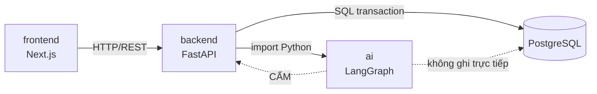
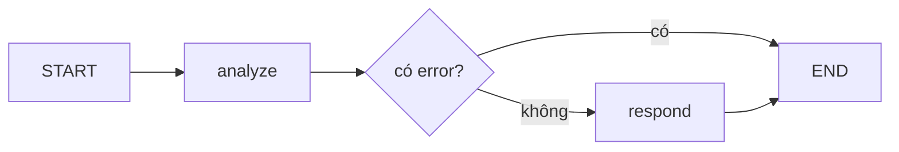
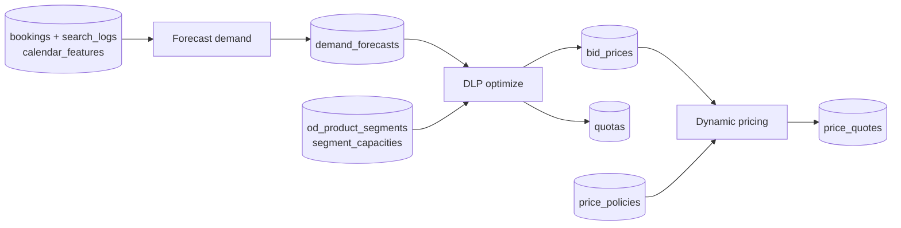
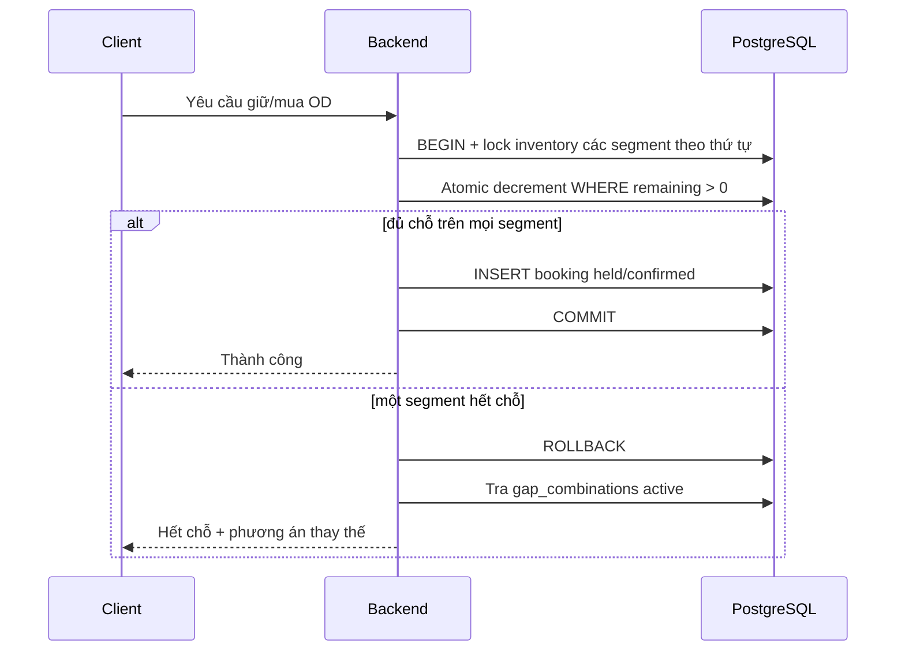
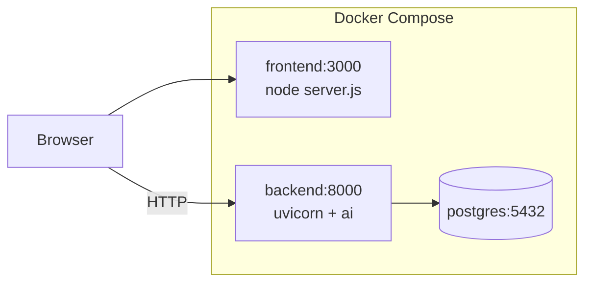

# Architecture Document

## System Overview

Monorepo gồm 3 module độc lập: `frontend/` (Next.js), `backend/` (FastAPI, bố cục MVC),
và `ai/` (forecasting, optimization, dynamic pricing). Backend import `ai` như một
thư viện Python trong cùng process; frontend nói chuyện với backend qua HTTP.
PostgreSQL là nguồn dữ liệu vận hành duy nhất của SRRM MVP.

## Module Boundaries

Đây là phần quan trọng nhất của tài liệu này. Ranh giới được kiểm tra tự động bằng
`scripts/check_boundaries.sh` (chạy trong CI, hoặc `make boundaries`).

| Quy tắc | Vì sao | Kiểm tra bởi |
|---|---|---|
| `ai` không import `backend` | AI phải dùng được ngoài HTTP: trong notebook, CLI, batch job | `check_boundaries.sh` |
| Chỉ `backend/services/` import `ai` | Controller đổi agent mà không phải sửa HTTP layer, và ngược lại | `check_boundaries.sh` |
| FE chỉ gọi HTTP qua `lib/api/` | Đổi base URL / auth header / xử lý lỗi chỉ sửa một chỗ | `check_boundaries.sh` |
| `ai` chỉ được import qua `ai/__init__.py` | `nodes`, `tools`, `state` là nội bộ, đổi tự do | quy ước |
| Chỉ backend service/repository ghi PostgreSQL | Giữ transaction, khóa tồn kho và audit trong một ranh giới | quy ước |
| AI nhận input có kiểu và trả kết quả, không tự cập nhật DB | Có thể test/replay thuật toán độc lập và tránh ghi snapshot dở dang | quy ước |

Config cũng tách theo ranh giới này: `ai/config.py` giữ LLM + vector store,
`backend/config.py` giữ app + CORS + database. Cả hai cùng đọc `.env` ở gốc repo.

## Components

### 1. `ai/` — Forecasting, Optimization và Pricing

Không biết gì về HTTP hoặc transaction database. Backend chuẩn bị snapshot đầu vào,
gọi interface công khai của `ai`, kiểm tra kết quả rồi mới lưu vào PostgreSQL.

Ba pipeline nghiệp vụ của AI:

- **Forecasting:** dùng booking, tìm kiếm không thành công và đặc trưng lịch để dự báo
  nhu cầu theo OD; trả dự báo điểm cùng p10/p50/p90.
- **Optimization:** dùng ánh xạ OD → chặng, sức chứa và dự báo để tính DLP; trả bid
  price theo chặng và quota theo OD.
- **Pricing:** cộng bid price của các chặng thành opportunity cost, đề xuất giá và
  giải thích; Policy Guard của backend ép trần/sàn và giới hạn biến động.

- **Interface công khai:** `ai/src/ai/__init__.py` → `run_agent(query) -> AgentResult`
- **State:** `AgentState` (TypedDict) — query, context, analysis, response, error, metadata
- **Nodes:** `analyze` → `respond`
- **Tools:** `search_knowledge`, `calculate`
- **Flow:**

### 2. `backend/` — FastAPI theo MVC

REST API không có "View" kiểu template HTML — ở đây **response body chính là view**.

| Tầng | Thư mục | Trách nhiệm |
|---|---|---|
| **C**ontroller | `controllers/` | Nhận HTTP, gọi service, trả view. Không chứa nghiệp vụ. |
| **M**odel | `models/` | Domain model + request schema |
| **V**iew | `views/` | Response schema (dùng trong `response_model`) |
| Service | `services/` | Nghiệp vụ. Tầng duy nhất import `ai`. |

Backend cũng sở hữu repository/transaction cho PostgreSQL. Đặc biệt, thao tác giữ
chỗ phải khóa và trừ `segment_inventory` trong cùng transaction; kết quả AI không
được dùng như bộ đếm tồn kho giao dịch.

Luồng: `controller → service → ai`, rồi `domain model → view → JSON`.

Lỗi agent được `ChatService` bọc thành `AgentError`, controller đổi thành HTTP 502.

### 3. `frontend/` — Next.js 14 App Router

Chia theo **feature**, không theo loại file. Thêm chức năng = thêm một thư mục trong
`features/`, không đụng phần còn lại.

| Thư mục | Trách nhiệm |
|---|---|
| `app/` | Routes — chỉ lắp ráp, không chứa logic |
| `features/<name>/` | Trọn vẹn một chức năng: components, hooks, api, types |
| `components/ui/` | Design system dùng chung |
| `lib/api/` | HTTP client — chỗ duy nhất gọi `fetch()` |
| `hooks/`, `types/` | Dùng chung nhiều feature |

Mỗi feature có `index.ts` làm interface công khai; bên ngoài không import sâu vào trong.

Tailwind CSS được biên dịch bằng PostCSS trong `next build` từ
`frontend/tailwind.config.ts`; production không phụ thuộc Tailwind CDN ở runtime để
tránh flash giao diện chưa có style trong lần tải đầu.

## Database Architecture

Schema nguồn nằm tại `schema.sql`. Các bảng được chia theo mục đích:

| Nhóm | Bảng | Vai trò |
|---|---|---|
| Danh mục | `stations`, `trains`, `seat_types`, `fare_classes` | Chuẩn hóa mã dùng chung, tránh sai join do typo |
| Chuyến và sức chứa | `trips`, `segments`, `seats`, `segment_capacities` | Mô tả hành trình và sức chứa gốc theo chặng × loại chỗ |
| Tồn kho giao dịch | `segment_inventory`, `bookings` | Fast path giữ/mua/hủy vé; hỗ trợ hold có TTL |
| Sản phẩm và ma trận DLP | `od_products`, `od_product_segments` | Định nghĩa OD và materialize ma trận a_lj |
| Đầu vào dự báo | `calendar_features`, `search_logs` | Lễ/Tết/mùa/thời tiết/sự kiện và nhu cầu không thỏa mãn |
| Output AI | `demand_forecasts`, `bid_prices`, `quotas` | Lưu kết quả có phiên bản của ba bước dự báo/tối ưu |
| Định giá | `price_policies`, `price_quotes` | Policy Guard, giá đề xuất/cuối và giải thích |
| Cache availability | `gap_combinations` | Tra cứu phương án lấp khoảng ghế trống khi hết chỗ |
| Kiểm toán | `audit_logs` | Lưu actor, hành động và dữ liệu trước/sau |

### Nguồn sự thật và dữ liệu dẫn xuất

- `segment_capacities.capacity` là sức chứa cấu hình của một chặng và loại chỗ.
- `segment_inventory.remaining` là tồn kho giao dịch hiện tại, được cập nhật nguyên tử.
- `bid_prices.remaining_capacity` chỉ là ảnh chụp đầu vào tại lúc tối ưu, không được
  dùng để xác nhận còn chỗ khi booking.
- `od_product_segments` được tạo cùng `od_products`; backend phải bảo đảm mọi segment
  thuộc cùng trip và nằm giữa ga đi–ga đến của OD.
- Heatmap tải, cảnh báo cháy vé và báo cáo hiệu năng vẫn được tính khi truy vấn, không
  cần thêm bảng vận hành.

`gt_demand` không nằm trong operational schema; nếu cần chấm dữ liệu mô phỏng Phase 1,
nó thuộc schema đánh giá tách biệt. Tham số độ co giãn nằm trong model artifact của
MVP; chỉ tạo `elasticity_params` khi serving cần cấu hình độc lập theo phân khúc.

## Data Flows

### 1. Batch dự báo → tối ưu → định giá

Backend đọc một snapshot đầu vào nhất quán, gọi AI, sau đó lưu toàn bộ output của
`run_version` mới. Không để AI ghi từng phần trực tiếp vào DB.

### 2. Hoán đổi snapshot AI

`bid_prices` và `quotas` lưu lịch sử theo `run_version`. Partial unique index bảo đảm
mỗi chặng × loại chỗ và mỗi OD chỉ có một dòng `is_active = TRUE`.

Trong một transaction, backend thực hiện:

1. Lưu kết quả phiên mới với `is_active = FALSE`.
2. Đánh dấu snapshot cũ thành inactive.
3. Đánh dấu toàn bộ kết quả hợp lệ của phiên mới thành active.
4. Commit; nếu bất kỳ bước nào lỗi thì rollback toàn bộ.

### 3. Tìm kiếm và nhu cầu không thỏa mãn

Mỗi yêu cầu tìm vé ghi một dòng `search_logs` với kết quả `found`, `sold_out` hoặc
`no_result`. Log này không chứa dữ liệu cá nhân nhạy cảm; nó dùng cho EM
unconstraining, KPI tìm kiếm hụt và phân tích chuyển đổi ở mức OD/kênh.

### 4. Hold và booking đồng thời

- Các segment được khóa theo `segment_id` tăng dần để giảm nguy cơ deadlock.
- Booking `held` phải có `expires_at`; worker định kỳ hủy hold quá hạn và hoàn tồn
  kho trong transaction.
- Booking `confirmed` giữ nguyên `booked_price`, không bị thay đổi bởi lần báo giá sau.
- `gap_combinations` được dựng theo batch/run version để request hết chỗ chỉ tra cache,
  không chạy lại thuật toán ghép khoảng trên từng request.

## Deployment Architecture

`ai` không có container riêng — nó nằm trong image của backend vì là thư viện.
`backend/Dockerfile` build từ gốc repo (cần copy cả `ai/` lẫn `backend/`).

Lưu ý: `NEXT_PUBLIC_API_URL` được nhúng vào bundle **lúc build**, không phải lúc chạy,
nên nó là build arg trong `frontend/Dockerfile`. Trình duyệt là bên gọi backend, nên
giá trị phải là URL nhìn từ máy user — không phải hostname nội bộ của compose.

### Vercel

Vercel uses two projects from this monorepo:

- The frontend project uses `frontend/` as its Root Directory and builds Next.js.
- The API project uses the repository root and `Dockerfile.vercel`. The container
  installs `libgomp1` for LightGBM, installs the local `ai/` and `backend/` packages,
  and starts `backend.main:app` on Vercel's injected `PORT`. The AI model remains
  in-process inside the backend container; it is not a separate HTTP service.
- `AI_MODEL_URL` and `AI_MODEL_SHA256` provide a checksum-verified fallback for
  serverless environments that omit `ai/models/model.pkl` from their bundle. The
  Vercel container normally reads the model directly from the image.
- The API function runs in Vercel `sin1`, matching the PostgreSQL database in
  AWS `ap-southeast-1`. AI modules and the LightGBM artifact are lazy-loaded on
  the first AI request so database-only dashboard traffic has a smaller cold start.

The frontend project must define `NEXT_PUBLIC_API_URL` with the API project domain.
The API project requires `APP_ENV=production`, `DATABASE_URL`, and `CORS_ORIGINS`
containing the frontend domain. LLM provider keys are only required when the graph
actually calls a provider; forecast, optimize, and price currently use
`ai/models/model.pkl` without an external AI API key.

## Security

- API keys ở `.env` (không bao giờ commit)
- Input validation qua Pydantic (`ChatRequest`: 1–5000 ký tự)
- `calculate` tool parse AST thay vì `eval()`
- CORS giới hạn theo `CORS_ORIGINS`
- Container chạy bằng non-root user (`appuser` / `nextjs`)

## Design Decisions

| Quyết định | Chọn | Lý do |
|---|---|---|
| Cấu trúc repo | Monorepo 3 module | Tách rõ mà vẫn atomic commit xuyên module |
| BE ↔ AI | Import trong process | Đủ cho quy mô hiện tại; không có độ trễ mạng, dễ debug. Nếu cần scale AI riêng, `run_agent` là chỗ duy nhất phải đổi thành HTTP call. |
| Bố cục BE | MVC + service | Yêu cầu dự án; service tách nghiệp vụ khỏi HTTP |
| Bố cục FE | Feature-based | Mở rộng theo chức năng, không theo loại file |
| Framework BE | FastAPI | Async, auto-docs, type-safe |
| Agent | LangGraph | Quản lý state linh hoạt |
| Frontend | Next.js 14 App Router | Chuẩn dự án lớn, SSR sẵn |
| Database MVP | PostgreSQL | Transaction, row locking, JSONB và partial index cho snapshot |
| Ánh xạ OD → chặng | Materialize trong `od_product_segments` | DLP và opportunity cost không phải suy lại mỗi request |
| Capacity và inventory | Tách hai bảng | Phân biệt cấu hình sức chứa với counter giao dịch sống |
| Snapshot AI | `run_version` + `is_active` | Đổi phiên nguyên tử, giữ lịch sử và hỗ trợ rollback |
| Gap availability | Cache `gap_combinations` | Fast lookup khi hết chỗ, tránh bão tính toán |
