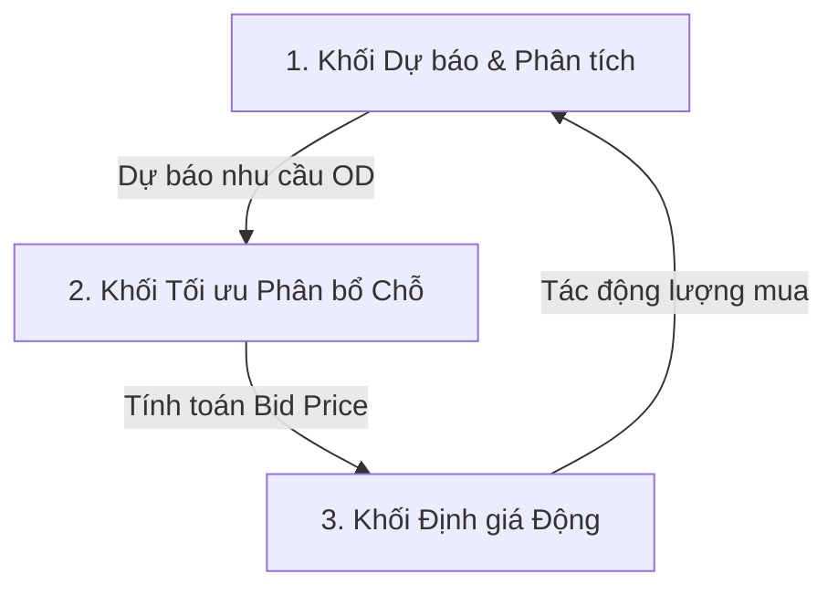

# Specs — Tầm nhìn Sản phẩm (Product Vision)

## 1. Tên Sản Phẩm
**Smart Rail Revenue Management (SRRM)** — Hệ thống AI Tối ưu Chỗ ngồi & Định giá linh hoạt cho Vận tải Hành khách Đường sắt.

---

## 2. Tuyên ngôn Tầm nhìn (Vision Statement)
Chuyển đổi phương thức quản lý vận tải đường sắt truyền thống từ **vận hành dựa trên quy tắc cố định, thủ công** sang **vận hành động, tối ưu hóa dựa trên dữ liệu và trí tuệ nhân tạo (AI)**. 

SRRM giúp doanh nghiệp vận tải đường sắt khai thác tối đa năng lực vận chuyển (ghế-km), xóa bỏ tình trạng "ghế trống cục bộ" trên các chặng ngắn trong khi "cháy vé" trên các chặng dài, đồng thời áp dụng chính sách giá linh hoạt phản ánh đúng quan hệ cung–cầu thị trường, tối đa hóa doanh thu và nâng cao chất lượng phục vụ hành khách tại tất cả các ga (bao gồm cả các ga trung gian).

---

## 3. Các Vấn đề Nghiệp vụ Cần Giải Quyết (Pain Points)

* **P1 — Từ chối bán vé sai lầm (Từ chối khách chặng ngắn):** Hệ thống chặn bán vé chặng ngắn để giữ chỗ cho chặng dài hơn theo luật cứng, ngay cả khi nhu cầu chặng dài không đạt kỳ vọng, dẫn đến mất cơ hội doanh thu.
* **P2 — Ghế trống cục bộ (Segment Fragmentation):** Ghế bị bỏ trống trên một hoặc vài chặng nhỏ nằm xen kẽ giữa các hành trình của các khách đã mua vé trước đó do thiếu thuật toán tối ưu xếp chỗ và ghép chặng.
* **P3 — Mất cân bằng cung cầu:** Nhu cầu di chuyển giữa các ga rất lệch nhau tùy theo mùa, thứ trong tuần, sự kiện. Các quy tắc phân bổ chỗ cứng không tự động điều tiết được lượng ghế trống này.
* **P4 — Định giá tĩnh cứng nhắc:** Giá vé áp dụng theo bảng giá cố định, chưa phản ánh mức độ khan hiếm thực tế của từng chặng cụ thể tại từng thời điểm mở bán.

---

## 4. Trụ cột Sản phẩm (Product Pillars)

Hệ thống được xây dựng trên 3 khối tính năng cốt lõi kết nối chặt chẽ qua đại lượng toán học chung là **Bid Price** (chi phí cơ hội của một ghế trên một chặng cụ thể):

1. **Dự báo & Phân tích thông minh:** Dự báo chính xác nhu cầu đi lại cho từng cặp ga đi–ga đến (Origin-Destination - OD) theo thời gian thực và tự động giải kiểm duyệt (unconstrain) dữ liệu lịch sử bị cắt do hết chỗ.
2. **Tối ưu hóa phân bổ chỗ ngồi:** Áp dụng quy hoạch tuyến tính tất định (DLP) để tính toán hạn ngạch vé và phân bổ chỗ vật lý thông minh, tối đa hóa hệ số sử dụng ghế-km và giảm phân mảnh tồn kho ghế.
3. **Định giá động linh hoạt:** Đề xuất mức giá bán vé theo thời gian thực dựa trên chi phí cơ hội của ghế và mức độ co giãn cầu, bảo đảm nằm trong khung ràng buộc trần/sàn được phê duyệt.

---

## 5. Phạm vi MVP (Vietnam Innovation Challenge 2026)

* **Phạm vi thử nghiệm:** Từ 1 đến 3 mã tàu chính trên tuyến đường sắt trọng điểm có nhiều ga trung gian (Ví dụ: Tuyến Bắc - Nam với các ga chính Hà Nội - Vinh - Đồng Hới - Huế - Đà Nẵng - Nha Trang - Sài Sòn).
* **Loại chỗ:** 1-2 loại chỗ phổ biến nhất (ví dụ: ngồi mềm điều hòa và giường nằm khoang 6) để kiểm chứng hiệu quả thuật toán.
* **Chế độ vận hành:** Chạy mô phỏng dữ liệu lịch sử (Phase 1) và Chạy song song không can thiệp trực tiếp (Shadow Mode - Phase 2) để chứng minh hiệu quả tài chính trước khi kết nối trực tiếp bán vé thời gian thực.
